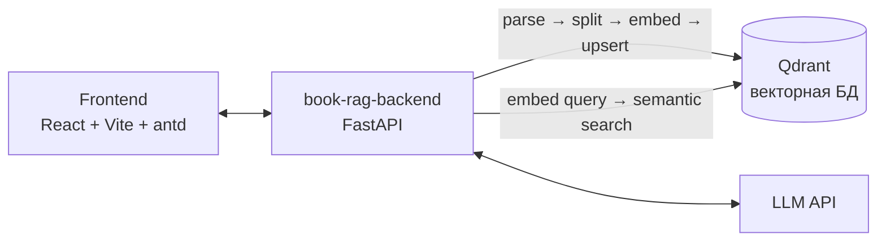

# Book RAG

Учебный групповой проект: сервис для загрузки книг в формате PDF и общения с ними — вопрос-ответ по содержимому книги с использованием RAG (Retrieval-Augmented Generation).

## Как это работает

1. Пользователь загружает PDF — файл парсится (включая таблицы), делится на чанки и индексируется в виде векторов в Qdrant
2. Пользователь задаёт вопрос по конкретной книге — вопрос векторизуется, в Qdrant находятся релевантные фрагменты именно этой книги
3. Найденные фрагменты вместе с историей диалога передаются в LLM, которая формирует ответ на основе содержимого книги



## Стек

**Backend**: FastAPI, Qdrant (векторный поиск), fastembed (эмбеддинги), LangChain text splitters (чанкинг), pdfplumber (парсинг PDF с таблицами), loguru, Prometheus (метрики)

**Frontend**: React 19, Vite, Ant Design, React Router, Axios; тесты — Vitest + Testing Library

**Инфраструктура и DevOps**: Docker / Docker Compose, Kubernetes (Helm-чарт: backend, frontend, Qdrant, HPA), ArgoCD (GitOps-деплой), Terraform (провижининг инфраструктуры в Yandex Cloud), Ansible (настройка хостов), SonarQube (статический анализ кода), Prometheus + мониторинг

**Тестирование**: pytest / pytest-asyncio (backend), Vitest (frontend), Locust (нагрузочное тестирование)

**Package management**: uv (backend), npm (frontend)

## Запуск

```bash
docker compose up
```

Backend поднимается вместе с self-hosted Qdrant; конфигурация — через `.env` (см. `.env.example` в `src/book-rag-backend`).

## Структура

```
src/
├── book-rag-backend/     # FastAPI-сервис: CRUD книг, парсинг/индексация, RAG-поиск
└── book-rag-frontend/    # React-интерфейс
k8s/                      # Helm-чарт и ArgoCD-манифесты для деплоя в Kubernetes
ansible/                  # плейбуки для настройки хостов
terraform/                # провижининг инфраструктуры (Yandex Cloud)
sonar-qube/               # конфигурация статического анализа
load-testing/             # нагрузочные тесты (Locust)
```
